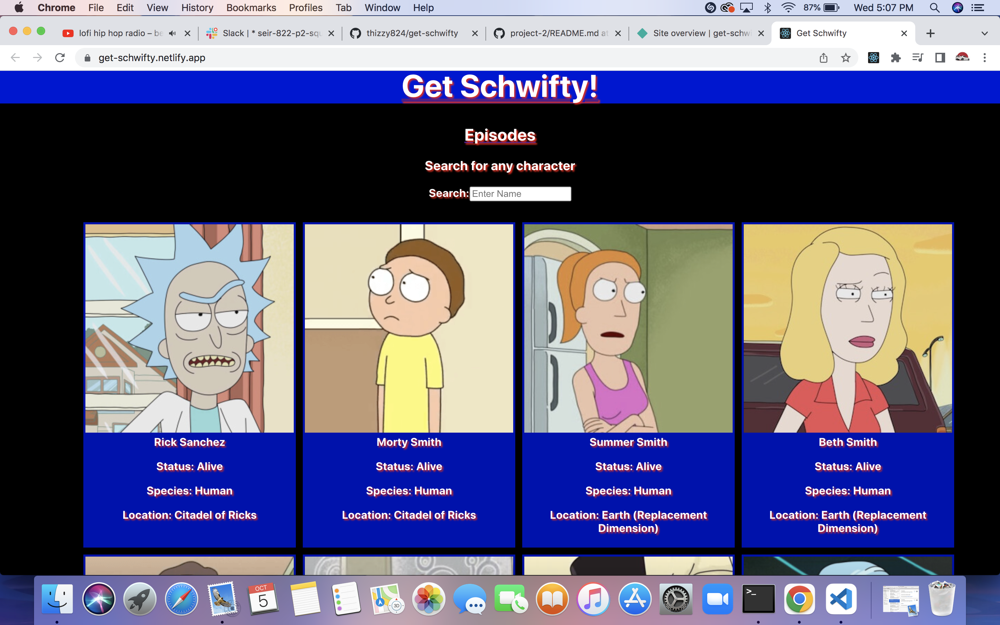

# Get Schwifty!

An interactive character and episode data base for the popular Rick and Morty series. Fans of the series will be able to search by name for any character that has made an appearance in the series along with any episode. The motivation for this project was the release of the new season of Rick and Morty since this is an on-going series.

###### Deployed Project

[https://get-schwifty.netlify.app/]

###### Get Schwifty Image

## Technologies Used

1. React (UseState, UseEffect, Routes, Links)
2. JavaScript
3. CSS
4. HTML

### Getting Started/Installation Technologies

User will be presented with 20 characters on startup. If user types a name in the search bar, characters relevant to the search will be rendered onto screen. If user clicks on 'Episodes' on the home screen, user will be navigated to the Episodes search page which functions the same as the Characters page.

### Contribution Guidelines

Users may contribute to code, identify bugs, and propose improvements by submitting an issue on Github or by forking/cloning the repo. User can create a separate branch and merge their improvements into the main branch.
